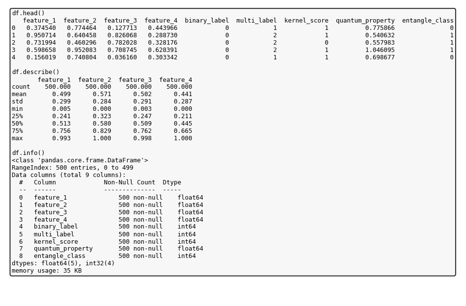
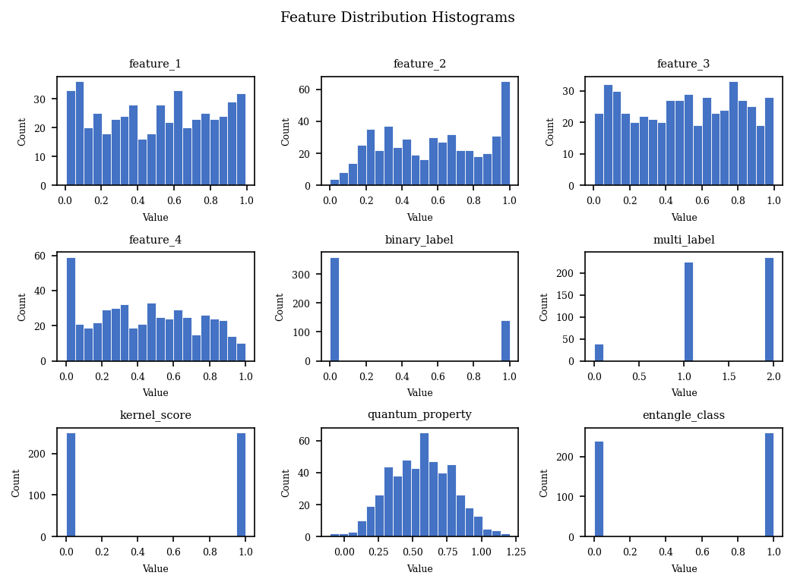
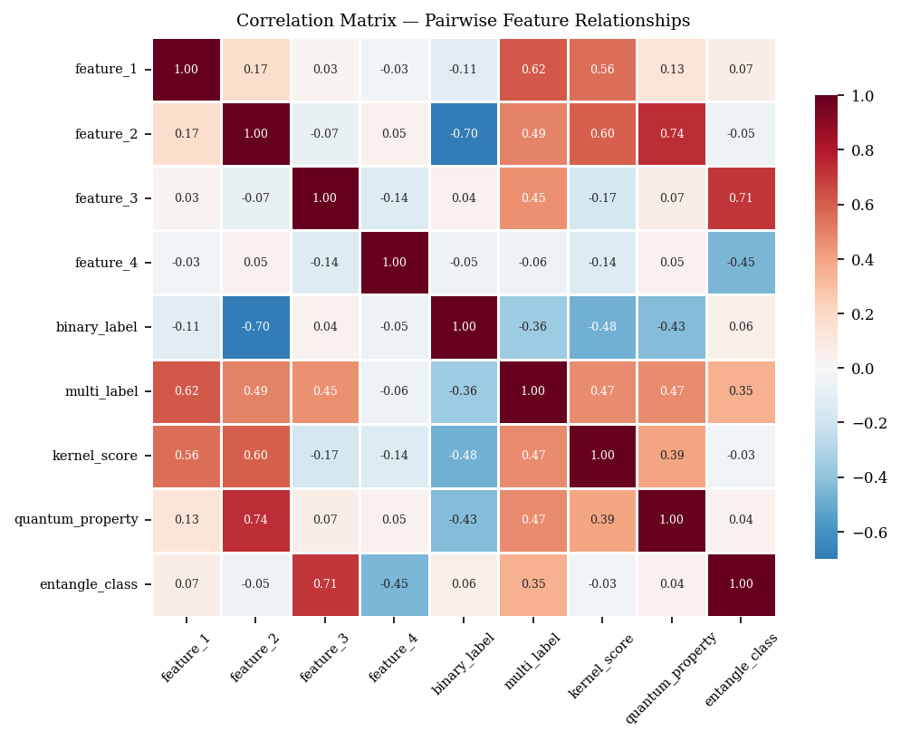
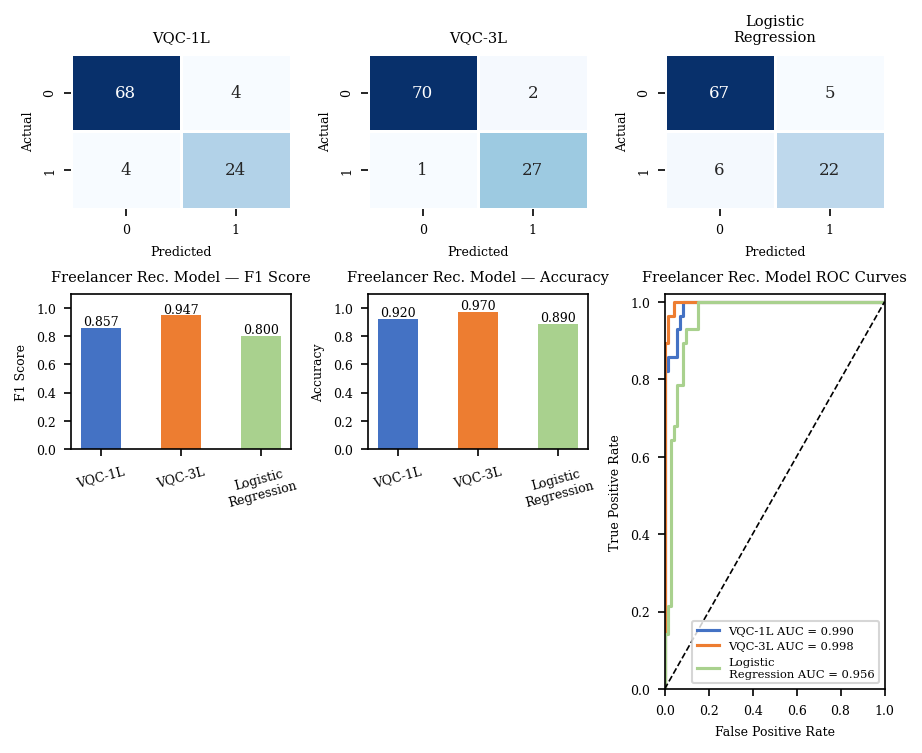

# Quantum Machine Learning with Variational Quantum Circuits

A research case study investigating **Variational Quantum Circuits (VQCs)** —
also known as Parameterized Quantum Circuits (PQCs) — as a hybrid
quantum-classical framework for classification and regression on NISQ-era
devices.


## Overview

Fifteen quantum and classical models were trained and evaluated on a synthetic
dataset of 500 entries with four numerical features (binary and multi-class
targets), including:

- VQC classifiers with **angle encoding**
- **Quantum Kernel** Support Vector Machines
- **Hybrid Quantum-Classical** Neural Networks
- **Entanglement-enhanced** classifiers

The **parameter-shift rule**, quantum state formalism, and variational
optimization are mathematically derived and applied. Models were assessed with
Accuracy, F1, ROC-AUC, R², MSE, and RMSE.

**Finding:** quantum kernel methods and entanglement-enhanced VQCs achieve
competitive — and often superior — performance over classical counterparts on
structured low-dimensional datasets.

## Contents

| File | Description |
|------|-------------|
| `VariaQ_VQC_Project_Report.md` | Full write-up (abstract, theory, methods, results) |
| `VariaQ_VQC_Project_Report.tex` | LaTeX (IEEE format) source of the paper |
| `generate_figures.py` | Reproduces all figures from the experiments |
| `fig1` … `fig8` | Dataset overview, distributions, correlation, and per-case results |

## Figures

| | |
|---|---|
|  |  |
|  |  |

## Reproduce

```bash
pip install qiskit pennylane scikit-learn numpy pandas matplotlib seaborn
python generate_figures.py
```

## Read the full paper

See **[`VariaQ_VQC_Project_Report.md`](VariaQ_VQC_Project_Report.md)** for the complete
report including the mathematical derivations and the full results table.
